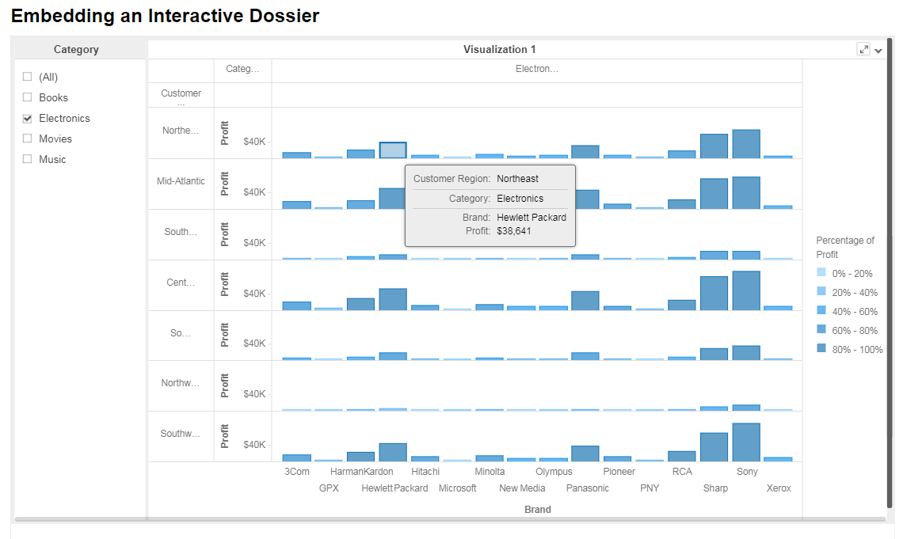

# MicroStrategy Embedding - How to embed an interactive Dossier during your analysis

### Python, JavaScript and HTML with Jupyter Magic commands

Example: 

Demonstrate how to use pure Python to navigate and find the Dossier we are interested in, display it inside Jupyter Notebook for interactive data analysis to better understand the data published by the business user and before loading that cube(s) into DataFrames. In this example I will show how to use pure code to accomplish this without having to go to the MicroStrategy Web or needing to right click to get object properties to obtain IDs.  

This tutorial follows the **MicroStratety REST API with Python** examples here https://github.com/tatwan/MicroStratety-Python-REST-API and my previous blog on **How to Embed MicroStrategy Dossier with Jupyter Notebook** here http://www.tarekatwan.com/index.php/2018/01/how-to-embed-microstrategy-dossier-with-jupyter-notebook/


```python
import requests
import json
from pandas.io.json import json_normalize
import pandas as pd
```

### Create required parameters


```python
### Parameters ###
username = 'Administrator'
password = ''
baseURL = "http://yourmstrEnv/MicroStrategyLibrary/api/"
```

Loading the python functions/script from the tutorial https://github.com/tatwan/MicroStratety-Python-REST-API by placing the code into a `mstr.py` file.


```python
import mstr 
```

**Steps:**
1. First we login to get `authToken` and a `sessionId` using our `login()` function
2. Once we are authenticated we can list all the projects that we have access to using our `listProjects()` function
3. We save the project ID of the project we are interested in into variable we will name `projectId`  
4. We get the library using our `getLibrary()` function in order to find the Id of the published Dossier we are interested in. In this case we need the `id` from the `target` column and we will save it into `libraryId` variable


```python
#step 1 - authenticate 
authToken, sessionId = mstr.login(baseURL, username, password)
```

    Token: 8fa2ngoiak50597n968cpo7so7
    Session ID: {'JSESSIONID': '2E05323BE41684698BF62C35AE9900BB'}
    


```python
#step 2 - search  projects
projectList = mstr.listProjects(baseURL, authToken, sessionId)
projectList
```


<div>
<table border="1" class="dataframe">
  <thead>
    <tr style="text-align: right;">
      <th></th>
      <th>id</th>
      <th>name</th>
      <th>description</th>
      <th>status</th>
    </tr>
  </thead>
  <tbody>
    <tr>
      <th>0</th>
      <td>B19DEDCC11D4E0EFC000EB9495D0F44F</td>
      <td>MicroStrategy Tutorial</td>
      <td>MicroStrategy Tutorial project and application...</td>
      <td>0</td>
    </tr>
    <tr>
      <th>1</th>
      <td>AF09B3E3458F78B4FBE4DEB68528BF7B</td>
      <td>Human Resources Analysis Module</td>
      <td>The Human Resources Analysis Module analyses w...</td>
      <td>0</td>
    </tr>
    <tr>
      <th>2</th>
      <td>4DD3B04B40D227471401609D630C76ED</td>
      <td>Enterprise Manager</td>
      <td></td>
      <td>0</td>
    </tr>
  </tbody>
</table>
</div>


```python
#step 3 - Get the project ID of the project we are interested in 
projectId = projectList.iloc[0][0]
projectId
```


    'B19DEDCC11D4E0EFC000EB9495D0F44F'


```python
# step 4 - Get the library List
libraryList = mstr.getLibrary(baseURL, authToken, sessionId, 'DEFAULT')
libraryList
```


<div>
<table border="1" class="dataframe">
  <thead>
    <tr style="text-align: right;">
      <th></th>
      <th>id</th>
      <th>name</th>
      <th>projectId</th>
      <th>active</th>
      <th>lastViewedTime</th>
      <th>target</th>
    </tr>
  </thead>
  <tbody>
    <tr>
      <th>0</th>
      <td>21A521BA4DB47ADAEBE19E9E9F7EC7D9</td>
      <td>Executive Business User Data Dossier</td>
      <td>B19DEDCC11D4E0EFC000EB9495D0F44F</td>
      <td>True</td>
      <td>2018-08-10T19:36:00.000+0000</td>
      <td>FC6E8B6F4950540FC3595093E0FBA306</td>
    </tr>
    <tr>
      <th>1</th>
      <td>80AFEAD447DE2430F7E41FBB1B1EFCBA</td>
      <td>Category Breakdown Dossier</td>
      <td>B19DEDCC11D4E0EFC000EB9495D0F44F</td>
      <td>True</td>
      <td>2018-08-10T18:55:49.000+0000</td>
      <td>95005DFF4C4829CF5EE6E98877726566</td>
    </tr>
  </tbody>
</table>
</div>


```python
#Get the Target ID for the published Dossier we want to embed
libraryId = libraryList.iloc[0][5]
libraryId
```


    'FC6E8B6F4950540FC3595093E0FBA306'


Using iPython magic cell we use `%%html` to specifiy were we want to display our Dossier.  

Dossier will be displayed right below this `%5html` cell once the `%%javascript` cell is executed. 


```python
%%html
<script type="text/javascript" src="http://yourmstrEnv/MicroStrategyLibrary/javascript/embeddinglib.js"></script>
<div id="dossier1"></div>
```



Again, using another iPython magic cell with `%%javascript` to load our Dossier 


```javascript
%%javascript
// we copy the projectID and libraryId and use them for the JavaScript variables below
var projectId = 'B19DEDCC11D4E0EFC000EB9495D0F44F' //IPython.notebook.kernel.execute(projectId);
var libraryId = 'FC6E8B6F4950540FC3595093E0FBA306' //IPython.notebook.kernel.execute(libraryId);

var container = document.getElementById("dossier1"),
 
    url = "http://yourmstrEnv/MicroStrategyLibrary/app/" + projectId + '/' + libraryId;
 
    microstrategy.dossier.create({
 
          url: url,
 
          enableResponsive: true,
 
          placeholder: container
       })

```

